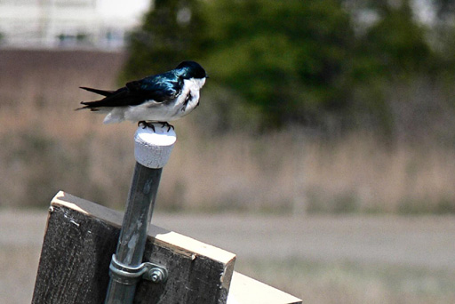
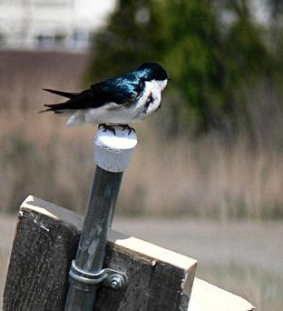
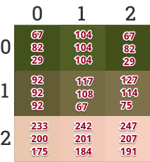
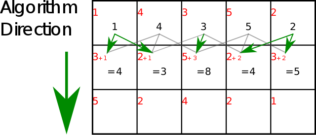
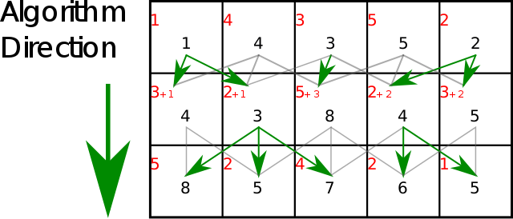
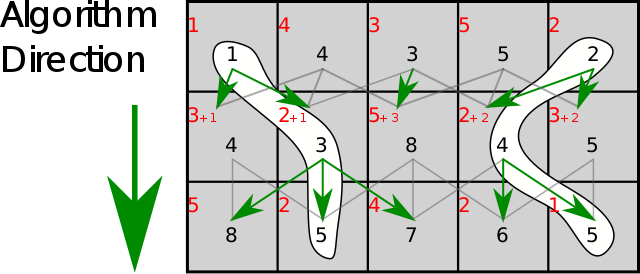
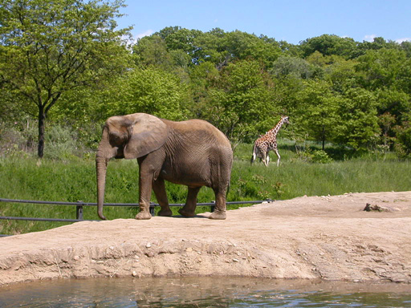

* * * * *

Programação C {.author}
-------------

05/2021 {.Date}
-------

  ---------------------------------------------- ---------------------------------------------- ------------------------------------------------------------
        
  (a) Original                                   (b) Alteração da largura                       (c) *Seam carving*
  ---------------------------------------------- ---------------------------------------------- ------------------------------------------------------------

Figura 1 Comparação entre imagens: original, redimensionada e através do
algoritmo de *seam* *carving*.

1 Introdução {.Seção}
============

Imagine que desejamos exibir uma imagem grande em um dispositivo com a
tela mais estreita, por exemplo, um celular. Uma forma de fazer isso é
redimensionar toda a imagem, mas ao fazer isso deixamos de usar parte da
tela, pois precisamos preservar as proporções. Outra forma seria
redimensionar somente a largura da imagem - só que assim a imagem
original ficaria distorcida.

Uma técnica publicada em um artigo no SIGGRAPH 2007
[[link]](http://graphics.cs.cmu.edu/courses/15-463/2015_fall/hw/proj3-seamcarving/imret.pdf)
[[vídeo]](https://www.youtube.com/watch?v=6NcIJXTlugc) por Shai Avidan e
Ariel Shamir tenta resolver esse problema: ela consiste essencialmente
em **remover as partes menos importantes** da imagem. Na figura 1, a
imagem original (a) tem a sua largura alterada (b) e sofre a aplicação
do algoritmo (c): observe como em (c) o pássaro não sofre nenhuma
distorção.

*Seam carving* é uma técnica **sensível ao contexto** para
redimensionamento de imagens, onde a imagem é reduzida de um pixel de
largura (ou altura) por vez. Um *seam* vertical (“costura”) é um
**caminho de pixels** conectado do topo à base com apenas um pixel em
cada linha. Diferentemente de técnicas tradicionais de redimensionamento
(por exemplo, recortar um pedaço da imagem ou mudar a escala inteira),
esta técnica preserva melhor as características mais interessantes (ou
relevantes) da imagem.

Veja na figura 2 o algoritmo em funcionamento: a linha vermelha
corresponde ao **melhor caminho****encontrado a cada momento. Observe
que a cada iteração, o algoritmo retira efetivamente uma coluna da
imagem, mas em posições diferentes por linha. O algoritmo termina quando
a largura desejada é atingida.


Figura 2 Algoritmo de *seam* *carving* em ação.

O algoritmo consiste em algumas etapas:

1.  Calcular a **energia** de cada pixel (veja a seção
    [1.1↓](https://mflash.github.io/progswb2/trab/t2-211-hfu7g67yercy7rfuc/index.html#sec:C%C3%A1lculo-da-energia))
2.  Construir uma **matriz** com o custo por linha, acumulando a energia
    de cima para baixo (veja a seção
    [1.2↓](https://mflash.github.io/progswb2/trab/t2-211-hfu7g67yercy7rfuc/index.html#subsec:C%C3%A1lculo-da-matriz)).
3.  Encontrar e remover o caminho com **menor energia total acumulada**,
    isto é, remover um pixel de cada linha, na coluna correspondente.
4.  Repetir as etapas 1-3 até atingir a largura desejada.

1.1  Cálculo da energia de cada pixel {.Subsection}
-------------------------------------

A **energia** de cada pixel é relacionada à importância deste para a
imagem. Quanto maior a energia de um pixel, menor a probabilidade de ele
ser incluído em um *seam*. Ela pode ser calculada de diversas formas, e
sabe-se que não há uma técnica que funcione igualmente bem para todas as
imagens. Neste trabalho utilizaremos uma técnica simples, denominada
*gradiente*. O cálculo do gradiente utiliza a seguinte fórmula:

Δ(𝑥,𝑦)=Δ2𝑥(𝑥,𝑦)+Δ2𝑦(𝑥,𝑦)

Onde:

Δ2𝑥(𝑥,𝑦)=Δ𝑅𝑥(𝑥,𝑦)2+Δ𝐺𝑥(𝑥,𝑦)2+Δ𝐵𝑥(𝑥,𝑦)2

E Δ𝑅𝑥(𝑥,𝑦)

, Δ𝐺𝑥(𝑥,𝑦)

e Δ𝐵𝑥(𝑥,𝑦)

são as diferenças entre as componentes R, G e B dos pixels (𝑥−1,𝑦)

e (𝑥+1,𝑦)

. O quadrado do gradiente para y - Δ2𝑦(𝑥,𝑦)

- é definido de forma análoga.

Por exemplo, supondo a seguinte região de uma imagem, onde os valores
RGB estão indicados:



Figura 3 Região 3x3 de uma imagem.

Supondo as coordenadas 0 a 2 para x e para y, vamos calcular a energia
do pixel central (1,1):

Δ𝑅𝑥(1,1)=𝑅𝑥(2,1)−𝑅𝑥(0,1)=127−92=35

Δ𝐺𝑥(1,1)=𝐺𝑥(2,1)−𝐺𝑥(0,1)=114−92=22

Δ𝐵𝑥(1,1)=𝐵𝑥(2,1)−𝐵𝑥(0,1)=75−92=−17

Portanto:

Δ2𝑥(1,1)=352+222+(−17)2=1998

Repetindo o processo para y:

Δ𝑅𝑦(1,1)=𝑅𝑦(1,2)−𝑅𝑦(1,0)=242−104=138

Δ𝐺𝑦(1,1)=𝐺𝑦(1,2)−𝐺𝑦(1,0)=201−104=97

Δ𝐵𝑦(1,1)=𝐵𝑦(1,2)−𝐵𝑦(1,0)=184−104=80

Portanto:

Δ2𝑦(1,1)=1382+972+802=34853

Δ(1,1)=1998+34853=36851

Observe que o gradiente é muito mais elevado em y do que em x: isso é
fácil de entender, uma vez que as cores variam muito mais na vertical do
que na horizontal. Mas como interessa ao algoritmo a soma dos
gradientes, o pixel central acaba recebendo uma energia alta.

Esse processo é repetido para todos os pixels da imagem. No caso das
bordas, onde não há um dos lados, pode-se utilizar o pixel do outro lado
da linha ou coluna (ex: no último pixel à direita, pode-se considerar a
diferença com o o penúltimo e o primeiro à esquerda).

1.2  Cálculo da matriz de custo acumulado {.Subsection}
-----------------------------------------

A partir da matriz com a energia de cada pixel, utilizaremos uma técnica
de programação dinâmica para calcular a chamada matriz de custo
acumulado: a intenção é identificar o caminho com menor soma acumulada
de energia, de cima para baixo.

Observe a figura 4, demonstrando esse cálculo para a segunda linha da
imagem:



Figura 4 Cálculo do custo acumulado até a segunda linha da imagem.
[[Wikipedia]](https://en.wikipedia.org/wiki/Seam_carving)

Cada quadrado representa um pixel, onde a energia calculada
anteriormente está representada em vermelho. Em preto está a soma
acumulada até este ponto (a primeira linha repete o valor da energia,
pois não há ninguém acima dela).

Na segunda linha, o primeiro pixel tem soma acumulada de 4, pois há dois
caminhos possívels: vindo pelo pixel com energia 1 ou pelo pixel com
energia 4. Nesse caso, opta-se sempre pelo caminho de menor custo. Já o
segundo pixel tem soma acumulada igual a 3, pois novamente opta-se pelo
caminho através do pixel com soma = 1 (as outras opções seriam 4 ou 3).
E assim por diante, até terminar a linha.

Para a terceira linha em diante, o processo é repetido (figura 5):



Figura 5 Cálculo do custo acumulado até a terceira linha da imagem.
[[Wikipedia]](https://en.wikipedia.org/wiki/Seam_carving)

No final, para encontrar o *seam* com menor soma acumulada de energia,
basta fazer o caminho inverso, isto é, de baixo para cima. No exemplo
simples da figura 6, há duas possibilidades (nesse caso, tanto faz qual
será escolhido).



Figura 6 Identificando o caminho com menor soma acumulada de energia.
[[Wikipedia]](https://en.wikipedia.org/wiki/Seam_carving)

Porém, nem sempre esse algoritmo produz resultados bons de forma
automática. Devido a isso, podemos utilizar uma segunda imagem, que
representa uma máscara onde marcamos as regiões que desejamos preservar
(verde) ou remover (vermelho).

 

Figura 7 Utilizando uma máscara para marcar regiões a manter (verde) ou
remover (vermelho).

Isso não exige uma alteração grande no algoritmo: basta aumentar a
energia dos pixels correspondentes à máscara em verde, e reduzir a
energia dos correspondentes à máscara em vermelho. Para reduzir a
energia, por exemplo, pode-se utilizar um valor "muito negativo" nesses
pixels, de forma que o caminho de menor custo sempre passe por eles.

Observe na figura 8 o resultado:


Figura 8 Removendo uma região específica.

2 Funcionamento {.Seção}
===============

Ao ser iniciado, o programa irá carregar dois arquivos de imagem (imagem
original e máscara). Para tanto, utilizaremos uma biblioteca simples,
integrada no projeto, chamada*SOIL*.

Após a leitura das imagens, o programa deverá realizar o algoritmo de
*seam carving*, armazendo o resultado em uma terceira imagem (ver
abaixo). O programa é capaz de exibir as 3 imagens, através das teclas
“1”, “2” e “3”. Ao pressionar "s", o algoritmo deverá ser executado
(função *seamcarve*). Essa função recebe a largura desejada, que é
inicializada com a largura das imagens. A largura pode ser ajustada com
as setas esquerda e direita - a cada ajuste, o programa chama
automaticamente a função *seamcarve.*

Uma vez que as imagens são armazenadas como grandes vetores, é
necessário converter as coordenadas desejadas (x,y) para uma posição
nesses vetores. Veja no código abaixo como fazer isso:

``` {.listing}
// Um pixel RGB (24 bits)
typedef struct {
    unsigned char r, g, b;
} RGB8;

// Uma imagem RGB
typedef struct {
    int width, height;   // largura e altura da imagem
    RGB8* img;            // vetor de pixels
} Img;

// As 3 imagens
Img pic[3];

// Após a leitura, pic[0], pic[1] e pic[2] armazenarão as imagens.
// Por conveniência, use os ponteiros source, mask e target, respectivamente.
// source => origem
// mask   => máscara
// target => saída do algoritmo

// Cada pixel está armazenado em X->img[i], onde X é a imagem desejada
// e i é o índice do pixel. Exemplo: acessando os dois primeiros pixels
// da imagem de origem
RGB8* aux1 = source->img[0];
RGB8* aux2 = source->img[1];

// Exemplo: acessando o pixel nas coordenadas (x=100,y=300) da primeira imagem:
RGB8* aux3 = source->img[300 * source->width + 100];
aux3->r = ...;
aux3->g = ...;
aux3->b = ...;

// Outra forma de fazer:
RGB8 (*ptr)[colunas] = (RGB8(*)[colunas]) source->img; // onde colunas é source->width

// A partir daí, dá para acessar com dois índices:
ptr[linha][coluna].r = ....;
ptr[linha][coluna].g = ....;
ptr[linha][coluna].b = ....;
...
```

3 Código base e imagens de teste {.Seção}
================================

**Download do código base:**
[seamcarving.zip](https://mflash.github.io/progswb2/trab/t2-211-hfu7g67yercy7rfuc/seamcarving.zip)

Este zip contém o projeto completo para a implementação do trabalho.
Esse código já implementa a exibição das 3 imagens na tela gráfica,
usando a biblioteca OpenGL. O projeto pode ser compilado no Windows,
Linux ou macOS, seguindo as instruções abaixo.

Para a compilação no Linux, é necessário ter instalado os pacotes de
desenvolvimento da biblioteca OpenGL. Para Ubuntu, Mint, Debian e
derivados, instale com:

``` {.listing}
sudo apt-get install freeglut3-dev
```

Para a compilação no Windows ou no macOS, não é necessário instalar mais
nada - o compilador já vem com as bibliotecas necessárias.

3.1 Visual Studio Code {.Subsection}
----------------------

Se você estiver utilizando o Visual Studio Code, basta descompactar o
zip e abrir a pasta.

Para **compilar**: use Ctrl+Shift+B (**⌘**+Shift+B no macOS).

Para **executar**, use F5 para usar o *debugger* ou Ctrl+F5 para
executar sem o *debugger*.

3.2 Outros ambientes ou terminal {.Subsection}
--------------------------------

Caso esteja usando outro ambiente de desenvolvimento, fornecemos um
*Makefile* para Linux e macOS, e outro para Windows (*Makefile.mk*).

Dessa forma, para compilar no Linux ou macOS, basta digitar:

``` {.listing}
make -j
```

Se estiver utilizando o Windows, o comando é similar:

``` {.listing}
mingw32-make -j -f Makefile.mk
```

Alternativamente, você também pode utilizar o *CMake* (*Cross Platform
Make*) para compilar pelo terminal. Para tanto, crie um diretório
*build* embaixo do diretório do projeto e faça:

``` {.listing}
cd build
cmake ..
make -j  # ou mingw32-make -j no Windows
```

4 Avaliação {.Seção}
===========

Leia com atenção os critérios de avaliação:

-   **É obrigatória a utilização de um repositório *git*. Crie um
    repositório privado em qualquer serviço (*GitHub*, *BitBucket*, ...)
    e compartilhe com o professor (instrucões no Moodle). Para evitar
    problemas, não deixe seu repositório público, pois outras pessoas
    poderão achá-lo facilmente e causar a anulação da sua nota.**
-   Pontuação:
    -   Cálculo da energia: 2 pontos
    -   Cálculo da acumulação de energia: 2 pontos
    -   Identificação do melhor caminho: 2 pontos
    -   Remoção do *seam* com melhor caminho: 2 pontos
    -   Utilização da máscara auxiliar para preservação/remoção de
        regiões: 2 pontos
    -   **Integrante da dupla sem commits no repositório do trabalho: -1
        ponto**
-   Os trabalhos são **em duplas ou individuais**. A pasta do projeto
    deve ser compactada em um arquivo .zip e este deve ser submetido
    pelo *Moodle* até a data e hora especificadas.
-   Não envie .rar, .7z, .tar.gz - apenas .zip.
-   O código deve estar identado corretamente.
-   **Programas que não compilarem terão sua nota anulada.**
-   **Programas que não utilizarem um repositório git terão sua nota
    anulada.**
-   **A cópia parcial ou completa do trabalho terá como conseqüência a
    atribuição de nota ZERO ao trabalho dos alunos envolvidos. A
    verificação de cópias é feita inclusive entre turmas.**
-   **A cópia de código ou algoritmos existentes da Internet também não
    é permitida**. Se alguma idéia encontrada na rede for utilizada na
    implementação, sua descrição e referência deve constar no artigo.

* * * * *
